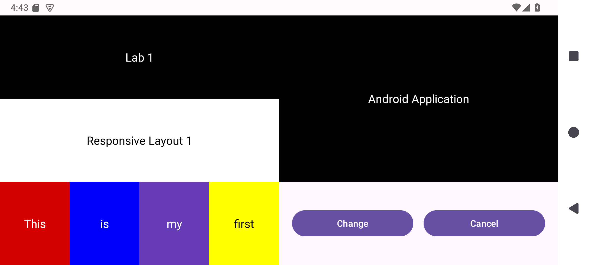
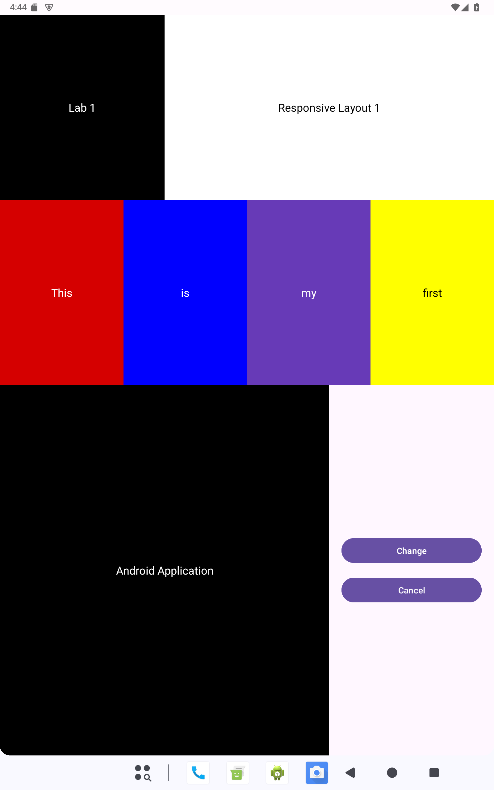
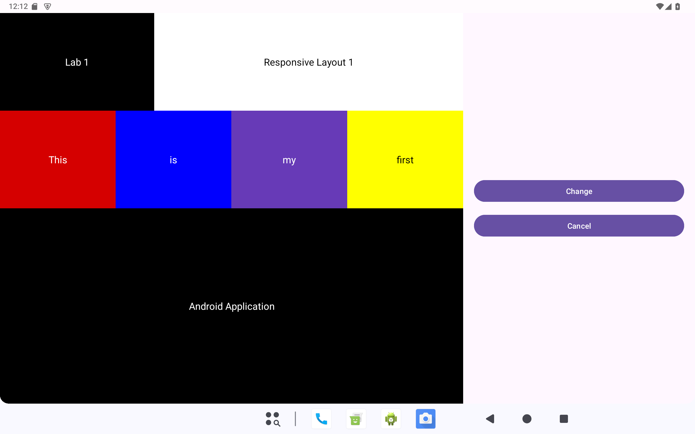

# 20243007027 Responsive Layout 2

This Android Studio project continues the Practical 1 LinearLayout layout. Android selects the matching activity_main.xml resource for each screen configuration; MainActivity does not need orientation-specific code.

## Layouts

| Configuration | Resource directory | Arrangement |
| --- | --- | --- |
| Phone portrait | app/src/main/res/layout | Original Practical 1 vertical layout |
| Phone landscape | app/src/main/res/layout-land | Two columns for content and actions |
| Tablet portrait (smallest width at least 600dp) | app/src/main/res/layout-sw600dp | Wide header and color row above content and actions |
| Tablet landscape (smallest width at least 600dp) | app/src/main/res/layout-sw600dp-land | Main content on the left, actions on the right |

The layouts use dp and sp units and LinearLayout weights so the panels share available space. Display text is defined in app/src/main/res/values/strings.xml.

## Open and run

1. Open this repository's root folder in Android Studio and wait for Gradle sync.
2. Select the app run configuration and start a phone emulator. Rotate it to see the landscape layout.
3. Start a tablet emulator whose smallest width is at least 600dp. Check both portrait and landscape.

The Android Studio build task :app:assembleDebug completed successfully on 2026-09-26.

## Verified screenshots

These screenshots were captured from a running Android API 35 emulator. The tablet screenshots used a temporary 800dp display configuration on the emulator.

### Phone landscape

### Tablet portrait

### Tablet landscape

